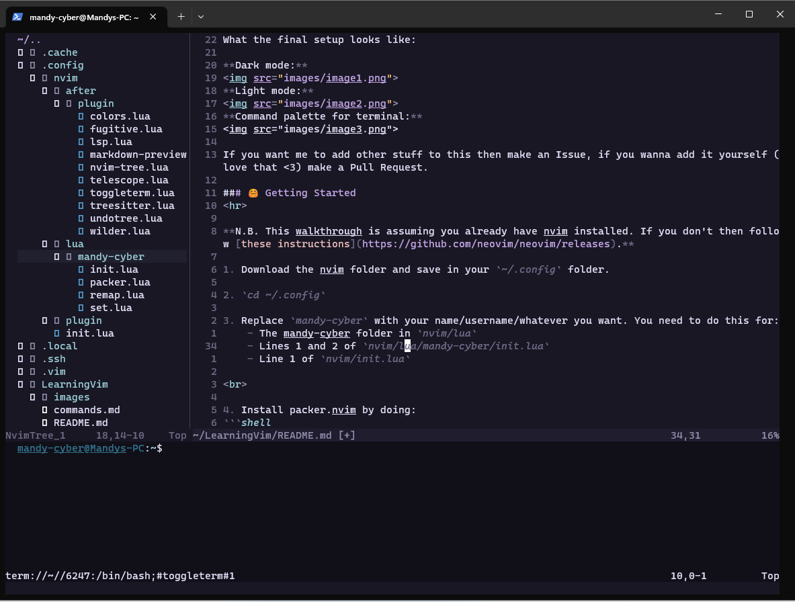

# Setup Nvim
> To run a command make sure you're in 'Normal' mode by pressing ESC, and then write the command. Typically something like **`:<command>`**


I started learning vim like 2 days ago so please if your name is Chad and you've been doing this since you slid out the womb, be gentle omg!


1. [The Final Product](#-the-final-product)
2. [Getting Started](#-getting-started)
3. [Commands & Remaps](#-commands-and-remaps)
4. [Useful Resources](#-useful-resources)
5. [Contact Me](#-contact)

<br>

## 🧠 The Final Product
What the final setup looks like:

**Dark mode:**

<br>

**Light mode:**

<br>

**Command palette for terminal:**

<br>

> If you want me to add other stuff to this then make an Issue, if you wanna add it yourself (love that <3) make a Pull Request.

<br>

## 🤗 Getting Started
**N.B. This walkthrough is assuming you already have nvim installed. If you don't then follow [these instructions](https://github.com/neovim/neovim/releases).**

1. Download the nvim folder and save in your `~/.config` folder.

<br>

2. `cd ~/.config`

<br>

3. Replace `mandy-cyber` with your name/username/whatever you want. You need to do this for:
    - The mandy-cyber folder in `nvim/lua`
    - Lines 1 and 2 of `nvim/lua/mandy-cyber/init.lua`
    - Line 1 of `nvim/init.lua`

<br>

4. Install [packer.nvim](https://github.com/wbthomason/packer.nvim) by doing:
```shell
git clone --depth 1 https://github.com/wbthomason/packer.nvim\
 ~/.local/share/nvim/site/pack/packer/start/packer.nvim
```

<br>

5. Open `nvim/lua/mandy-cyber/packer.lua` with nvim and run the command `:so`
    - Check that a bunch of things are downloading correctly by then running the command `:PackerSync`
    - Yes you will see a gazillion warning messages when you're opening the file, just ignore them for now.

<br>

6. Not sure if this step is entirely necessary but just in case (idk) go in each of the files in `nvim/after/plugin` and run the `:so` command again. Should be pretty quick.

<br>

7. All done (hopefully lol)!

<br>

### Common Errors
- If it says something about missing a C compiler
    - Run `sudo apt-get install build-essential` in your terminal
    - Full issue [here](https://github.com/LunarVim/Neovim-from-scratch/issues/274)

- If you get an error saying 'Pre build and node not found" when trying to use MarkdownPreview
    - Run the `:call mkdp#util#install()` command in nvim
    - Full Issue [here](https://github.com/iamcco/markdown-preview.nvim/issues/7)

- If you get another error please consider asking someone smarter than me <3

<br>

## 🤖 Commands and Remaps
Now, read through `commands.md` to see different commands you can run with the plugins you've installed as well as the remaps I made for some of them.

You can change the remaps in `nvim/lua/mandy-cyber/remap.lua` as well as in the individual plugin files in `nvim/after/plugin`.

Oh also note that the function in `colors.lua` is not from a plugin. It's just one I wrote.

AH one more thing, for basic vim settings and yada yada (like indent size and spell-checking) you can make changes in `nvim/lua/mandy-cyber/set.lua`

<br>

## ✏️ Useful Resources
A big chunk of all this I got from watching [this](https://www.youtube.com/watch?v=w7i4amO_zaE) youtube video by ThePrimeagen on 0.5x speed, and then added my own flava and whatnot. Other useful resources include:

📽️ [Vim Tutorial for Beginners](https://www.youtube.com/watch?v=RZ4p-saaQkc&t=2724s&pp=ygURdmltIGZvciBiZWdpbm5lcnM%3D) - i watched the first like 40 minutes to get a general understanding of the basics of vim and it was more than enough knowledge for me to follow along with the ThePrimeagen video.

💖 [Vim cheatsheet](https://devhints.io/vim) - exactly what it sounds like

🎨[Vimcolorschemes](https://vimcolorschemes.com/) - for a gazillion other cool colorschemes you can download

🥳 [awesome-neovim](https://github.com/rockerBOO/awesome-neovim) - for a bunch of nvim plugin suggestions/recommendations

💻 [Neovim Options](https://neovim.io/doc/user/options.html) to see an overview of nvim options you can set (check `nvim/lua/mandy-cyber/set.lua`)

<br>

## Contact
If you've got questions or wanna just chat you can find me here [on GitHub](https://www.github.com/Mandy-cyber), or [on Linkedin](), or email me at `acm.rodriques at gmail dot com` 

<br>

**- Mandy <3**
